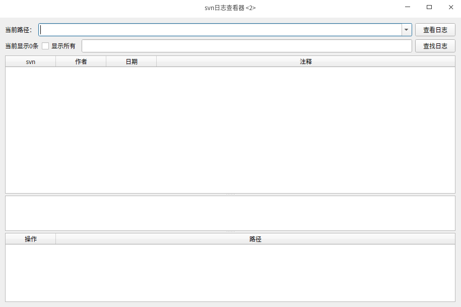

>这是一个查看svn日志的程序，解决linux环境下无法安装TortoiseSVN，命令行下面看日志不爽问题

## 效果
页面基本参照TortoiseSVN画的


## 使用
基本是打开就会使用。路径处输入`svn://svnserver/xxxx`，点击查看日志即可。
搜索功能：支持空格分隔过滤多个关键字
**注意：** 不支持认证，如果程序无法正常运行，请先在命令行下执行`svn log xxxx`等命令通过授权，再执行本程序

## 原理
核心工作原理是基于命令行的svn命令，通过svn命令获取日志保存在xml文件中，然后解析文件，呈现在GUI中，差异的对比使用的meld。  

其实在这个应用里面，我直接调用`svn diff xxxxxx`来查看差异，因为我本地svn配置了使用meld查看差异，所以会直接打开meld

### svn diff-tool配置
`~/.subversion/config`
主要修改下面两行
```
diff-cmd = meld
# -n参数，在meld的新标签页中打开对比文本
diff-extensions = -n
```
